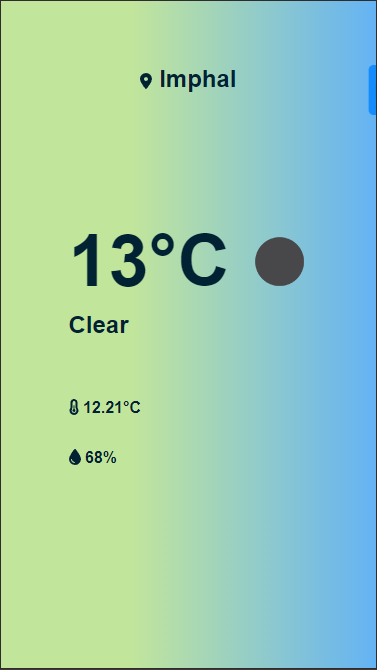
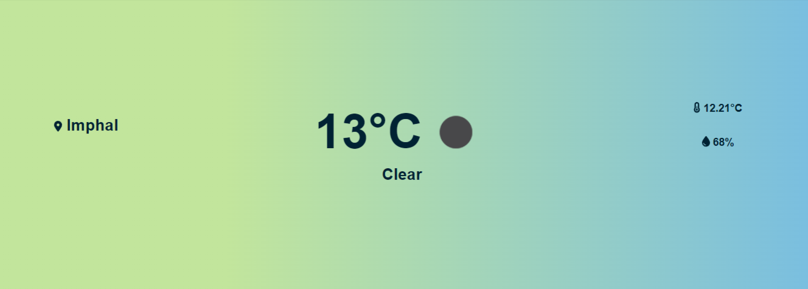

<div align="center">
 
  <br/>
  <h1><b>JetLogix</b></h1>

</div>

<a name="readme-top"></a>

<!-- TABLE OF CONTENTS -->

# 📗 Table of Contents

- [📖 About the Project](#about-project)
  - [🚀 Back End](#back-end)
  - [🛠 Built With](#built-with)
    - [Tech Stack](#tech-stack)
    - [Key Features](#key-features)
  - [🚀 Screenshots](#live-demo)
  <!-- - [💻 Presentation](#video-presentation) -->
- [💻 Getting Started](#getting-started)
  - [Setup](#setup)
  - [Prerequisites](#prerequisites)
  - [Install](#install)
  - [Usage](#usage)
- [👥 Authors](#authors)
- [🔭 Future Features](#future-features)
- [🤝 Contributing](#contributing)
- [⭐️ Show your support](#support)
- [❓ FAQ](#faq)
- [📝 License](#license)

<!-- PROJECT DESCRIPTION -->

# 📖 React Weather App <a name="about-project"></a>

A weather app to retrieve data from API and display the data in real time using Socket.io.

## 🚀 BackEnd <a name="back-end"></a>

 [Click here to see the weather-api](https://github.com/rubydevi/react-weather-api)

## 🛠 Built With <a name="built-with"></a>

### Tech Stack <a name="tech-stack"></a>

  - React
  - Node.js
  - CSS

### Key Features <a name="key-features"></a>

> Display weather details

> Get your location

> Socket.io

<p align="right">(<a href="#readme-top">back to top</a>)</p>

<!-- LIVE DEMO -->

## 🚀 Screenshots <a name="live-demo"></a>


- Mobile View
- 

- Desktop View
- 

<p align="right">(<a href="#readme-top">back to top</a>)</p>
<!-- GETTING STARTED -->

## 💻 Getting Started <a name="getting-started"></a>

To get a local copy up and running, follow these steps.

### Prerequisites

In order to run this project you need:

### Setup

Clone this repository to your desired folder:

```sh
 git clone https://github.com/rubydevi/react-weather-app.git
```

### Install

Install this project with:

```sh
  cd my-project
  npm install or yarn install
```

### Usage

To run the project, you will need to execute:

```sh
   npm start
```


<p align="right">(<a href="#readme-top">back to top</a>)</p>
<!-- AUTHORS -->

## 👥 Authors <a name="authors"></a>

👤 Chongtham Ruby Devi

- GitHub: [@rubydevi](https://github.com/rubydevi)
- LinkedIn: [@Chongtham Ruby Devi](https://www.linkedin.com/in/chongtham-bhoomika/)


<p align="right">(<a href="#readme-top">back to top</a>)</p>

<!-- FUTURE FEATURES -->

## 🔭 Future Features <a name="future-features"></a>

> Hourly and Weekly Forecast

> Sunrise and Sunset Data

<p align="right">(<a href="#readme-top">back to top</a>)</p>

<!-- CONTRIBUTING -->

## 🤝 Contributing <a name="contributing"></a>

Contributions, issues, and feature requests are welcome!

Feel free to check the [issues page](https://github.com/rubydevi/jetlogix-frontend/issues).

<p align="right">(<a href="#readme-top">back to top</a>)</p>

<!-- SUPPORT -->

<!-- SUPPORT -->

## <b>Show your support 🌟</b><a name="support"></a>

Thank you for taking the time to explore this project! Your support means a lot to me. If you find my project valuable and would like to contribute, here is one way you can support me:

- <b>Star the project ⭐️</b>: Show your appreciation by starring this GitHub repository. It helps increase visibility and lets others know that the project is well-received.

- <b>Fork the project 🍴 🎣</b>: If you're interested in making improvements or adding new features, feel free to fork the project. You can work on your own version and even submit pull requests to suggest changes.

- <b>Share with others 🗺️</b>: Spread the word about this project. Share it on social media, mention it in relevant forums or communities, or recommend it to colleagues and friends who might find it useful.

<p align="right">(<a href="#readme-top">back to top</a>)</p>

<!-- FAQ (optional) -->

## ❓ FAQ <a name="faq"></a>

- **Question_1**

  Do I have to use the vs code specifically?

  - Answer_1

    You can use any one of your favortite or prefered editors<br>

<p align="right">(<a href="#readme-top">back to top</a>)</p>


<!-- LICENSE -->

## 📝 License <a name="license"></a>

[](./LICENSE)

<p align="right">(<a href="#readme-top">back to top</a>)</p>
